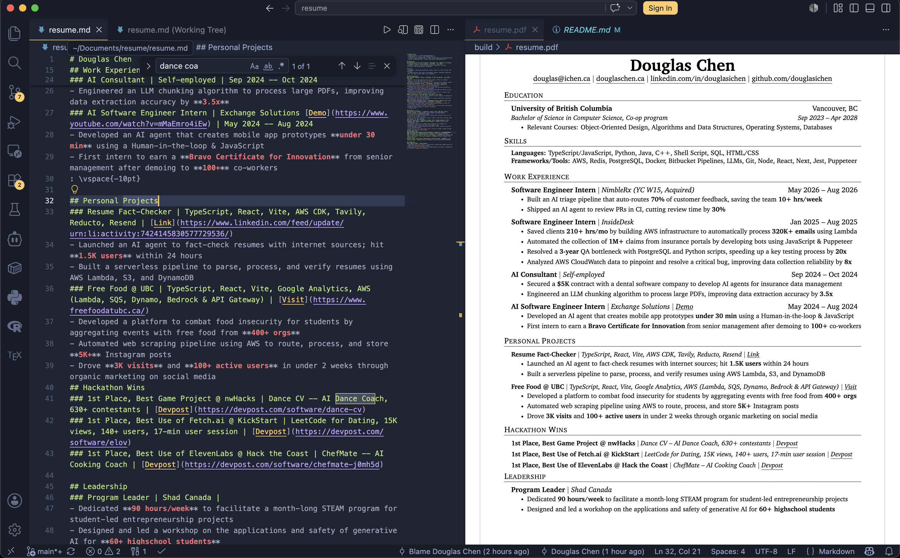

# Résumé

My résumé, written in **Markdown** and compiled to a polished one-page PDF through
LaTeX. Edit `resumes/resume.md`, save, and its PDF rebuilds itself — you never have to
touch the LaTeX.

```
resumes/resume.md  ──(scripts/md2tex.py)──▶  resumes/resume.tex  ──(latexmk)──▶  build/resume.pdf
```



## Quick start

```sh
# one-off build  ->  build/resume.pdf
python3 scripts/md2tex.py resumes/resume.md resumes/resume.tex && latexmk resumes/resume.tex

# or just edit resumes/resume.md in VSCode — see "Auto-rebuild" below
```

You need a TeX distribution. On macOS:

```sh
brew install --cask mactex-no-gui     # provides latexmk + pdflatex at /Library/TeX/texbin
```

See [Dependencies](#dependencies) for exact versions.

## VSCode setup (the convenient workflow)

Install **one** extension:

```sh
code --install-extension james-yu.latex-workshop
```

- **LaTeX Workshop** (`james-yu.latex-workshop`) — gives you the in-editor PDF pane that
  **auto-refreshes** whenever `build/resume.pdf` changes. That's the right-hand window in
  the screenshot above. (This repo's `settings.json` already points it at `latexmk` and
  the `build/` output folder.)

Markdown editing needs **no** extension — it's built into VSCode. Open the PDF preview
with `Cmd+Option+V` (or click the preview icon on `resumes/resume.tex` / `build/resume.pdf`).

### Auto-rebuild

Open this folder in VSCode and a watcher starts automatically (`scripts/watch.sh`, wired
up in `.vscode/tasks.json` via `runOn: folderOpen`). Every time you save `resumes/resume.md`,
it regenerates the LaTeX and recompiles the PDF. The first time, VSCode asks to
**"Allow Automatic Tasks"** — allow it once.

Recommended layout (as pictured): `resumes/resume.md` on the left, `build/resume.pdf`
open in the LaTeX Workshop viewer on the right.

Run the watcher by hand instead: `./scripts/watch.sh` (zero dependencies — it polls the
file's mtime once a second).

## Markdown format

```
# Name                       -> centered name
- display | url              -> a contact link (one per line, under the name)

## Section                   -> a section heading
### a | b | c [| d]          -> an entry; field meaning depends on the section:
       Education                          -> org | location | degree | dates
       Personal Projects / Hackathon Wins -> name | tech stack | [label](url)
       (anything else)                    -> title | org | dates
                                             (org may end with [label](url))
- bullet text                -> a résumé bullet; **bold** becomes \textbf{...}
: \rawlatex                  -> inject raw LaTeX here (e.g. `: \vspace{-12pt}`)
```

An entry with no bullets can still carry a bare `: \rawlatex` directive (e.g. to nudge
spacing after a bullet-less Hackathon Wins entry) — it's emitted directly instead of
being wrapped in an empty bullet list.

- Special characters (`& % $ # _ { } ~ ^ \`) are auto-escaped — write `React & Next`,
  `$5K`, `70%` naturally.
- The **Skills** section uses `- Label: a, b, c` bullets (no `###` entries).
- `[label](url)` anywhere a link is expected becomes a proper hyperlink.

## Files

| Path | Purpose |
|------|---------|
| `resumes/resume.md` | **Source of truth.** Edit this. |
| `scripts/md2tex.py` | Markdown → LaTeX converter (preamble baked in; output matches the generated `.tex` 1:1). |
| `scripts/watch.sh` | Zero-dependency file watcher that rebuilds on save. |
| `scripts/test_md2tex.py` | Test suite for the converter (`python3 scripts/test_md2tex.py`). |
| `resumes/resume.tex` | **Generated** from `resumes/resume.md` on each build — don't edit by hand. |
| `resume-dirty.tex` | Full archive of alternate bullet phrasings, kept as LaTeX comments. |
| `.vscode/tasks.json` | Auto-starts the watcher when the folder is opened. |
| `.latexmkrc` | Sends all build output to `build/`. |
| `media/` | Screenshots used in this README. |
| `build/` | Compiled PDF + aux files (gitignored). |

## Tests

```sh
python3 scripts/test_md2tex.py
```

Covers escaping, bold, links, field parsing, section dispatch, spacing directives, and
end-to-end LaTeX compilation of adversarial inputs. Uses only the Python standard library.

## Dependencies

Versions in the "tested" column are what this repo was built and verified against;
nearby versions should work fine.

| Dependency | Tested version | Required? | Purpose | Install |
|------------|----------------|-----------|---------|---------|
| macOS | 14 (darwin 24) | yes | host OS (paths assume `/Library/TeX/texbin`) | — |
| MacTeX (no GUI) | `2026.0324` (TeX Live 2026) | yes | LaTeX engine: `latexmk` 4.88, `pdfTeX` 1.40.29 | `brew install --cask mactex-no-gui` |
| Python | `3.10.17` (3.8+ works) | yes | runs `md2tex.py` (standard library only — no `pip install`) | preinstalled, or `brew install python` |
| Bash | `5.2` (3.2+ works) | yes | runs `scripts/watch.sh` | preinstalled on macOS |
| VSCode | `1.125.1` | for the live workflow | editor + PDF preview pane | [code.visualstudio.com](https://code.visualstudio.com) |
| LaTeX Workshop (VSCode ext) | `james-yu.latex-workshop@10.16.1` | for the live workflow | auto-refreshing in-editor PDF preview | `code --install-extension james-yu.latex-workshop` |
| Poppler | any | optional (dev only) | `pdfinfo` / `pdftoppm` for page-count & pixel checks | `brew install poppler` |

The LaTeX packages the template uses (`fontawesome5`, `charter`, `marvosym`, `hyperref`,
`titlesec`, `enumitem`, `eso-pic`, …) all ship with **MacTeX-full** — no manual `tlmgr`
installs needed.

## Make it your own (with Claude Code)

This repo is wired to one specific LaTeX template, but the whole setup — Markdown
source, auto-rebuild watcher, and tests — works with *any* résumé template. The
easiest way to retarget it is to let [Claude Code](https://claude.com/claude-code)
do the conversion for you.

1. Drop your existing résumé's LaTeX into the repo (e.g. `mytemplate.tex`), or grab a
   template you like. A *filled-in* example works best — Claude can see how each entry
   type is structured.
2. Open the folder in Claude Code and ask it something like:

   > Re-bake `scripts/md2tex.py` to use `mytemplate.tex` as the LaTeX preamble and macros
   > instead of the current one. Adapt the section dispatch (`sectype_for`) and entry
   > emitters (`emit_*`) to match its commands, put my content in `resumes/resume.md`,
   > then regenerate `resumes/resume.tex` and verify the rendered PDF is pixel-identical
   > to compiling `mytemplate.tex` directly. Keep `scripts/test_md2tex.py` green.

3. Claude Code swaps the baked-in preamble, rewrites the emitters to fit your template's
   macros, updates the section names, and confirms the output matches.

Then just edit `resumes/resume.md` and the watcher does the rest.

**Tips**
- Tell Claude which `md2tex.py` entry format each of your sections should use if you have
  unusual ones (e.g. *Publications*, *Awards*).
- The pixel-identical check (render both PDFs to images, compare hashes) is how this repo
  was validated — ask Claude to do the same so you can trust the conversion.
- Don't edit `resumes/resume.tex` by hand afterward; it's regenerated from the `.md`.

## Credits

Built on the [Jake Gutierrez résumé template](https://github.com/sb2nov/resume) (MIT).
